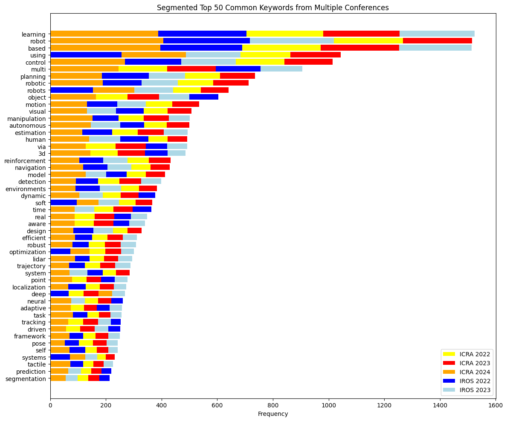

# ICRA-IROS-Keyword-Visualization-Discover-Trends-in-Robotics-Research
 This interactive data visualization tool allows you to explore and analyze the most common keywords in research papers from the **ICRA** and **IROS** conferences. Gain insights into the evolving trends and focus areas in robotics research by selecting different conference-year combinations.
 
Check out the Gradio interface [here](https://huggingface.co/spaces/NirajPudasaini/Robotics-Research-Keyword-Visualization-ICRA-and-IROS).


## Features

- **Dynamic Keyword Analysis**: Select conference-year combinations and visualize the top keywords.
- **Interactive Webpage based Visualizations**: Explore segmented bar charts that display keyword frequencies across multiple conferences. Thanls to Gradio. 
- **Comprehensive Data**: Keywords extracted from the paper titles from ICRA and IROS conferences from 2022 to 2024 (IROS 2024 to be updated).

## How It Works 

1. **Select Conference-Year Combinations**: Use the checkboxes to choose the desired conferences and years.
2. **Generate Plot**: Click the "Generate Plot" button to see the visualized keyword analysis.
3. **Explore Insights**: View the segmented bar chart to understand the common keywords and their frequencies.



## Citation

If you use this code or data in your research, please cite:

```bibtex
@online{pudasaini2024,
  author = {Pudasaini, Niraj},
  title = {ICRA \& IROS Keyword Visualization: Discover Trends in Robotics Research Discover Trends in Robotics Research},
  date = {2024-07-30},
  url = {https://github.com/NirajPudasaini/ICRA-IROS-Keyword-Visualization-Discover-Trends-in-Robotics-Research},
  langid = {en}
}
```

For attribution, please cite this work as:

**Pudasaini, Niraj. 2024. “ICRA & IROS Keyword Visualization: Discover Trends in Robotics Research.” July 30, 2024. https://github.com/NirajPudasaini/ICRA-IROS-Keyword-Visualization-Discover-Trends-in-Robotics-Research.**
```
